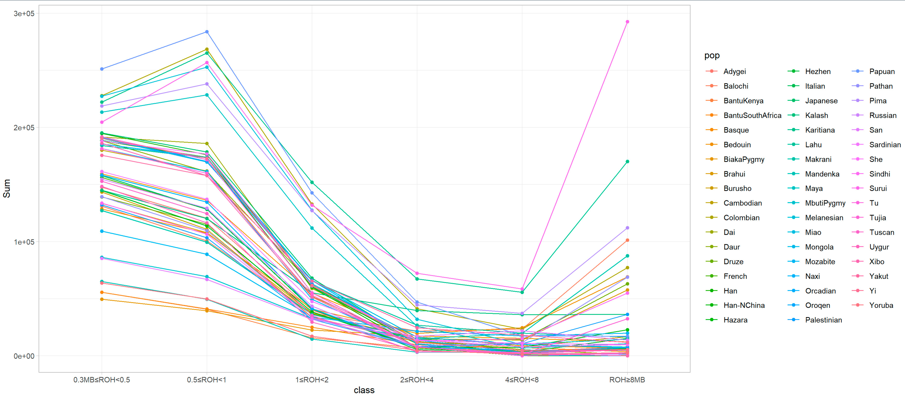
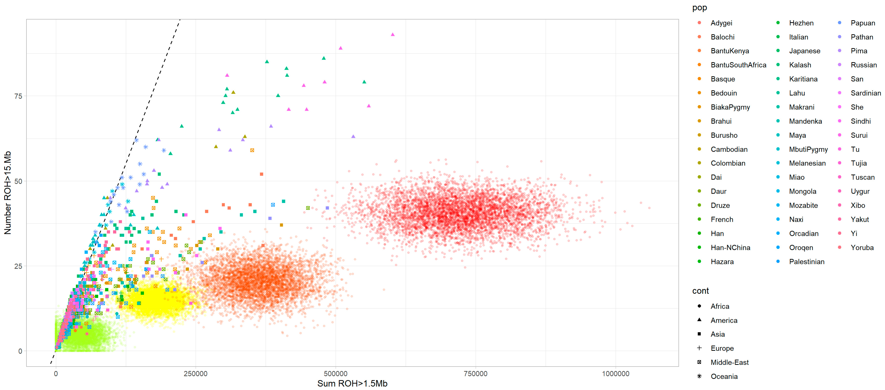

## Package Overview

The analysis of autozygosity through the **Runs of Homozygosity (ROH)** --contiguous regions of the genome where an individual is homozygous across all sites-- is an alternative and relatively new approach to answer many important questions in modern genetics, including population history and the genetic architecture of complex traits.
 <br><br>
This package provides with several useful functions to represent and analyze **PLINK's ROH outcomes**. The following script in bash is recommended to search of ROH in humans. The following PLINK's conditions are optimal for ROH searching in humans when a minimun of 1.5M SNP is used.

```{=html}
<pre><code>plink  \
  --bfile path/to/bfile \
  --homozyg-window-snp 30 \
  --homozyg-window-het 1 \
  --homozyg-snp 30 \
  --homozyg-kb 300 \
  --homozyg-density 30 \
  --out path/to/folder
</code></pre>
```
This bash script will generate a .hom file with all the information needed. This package takes that tabular file and process it to obtain different summary outcomes, figures and other features.

### Data avaliable with this package

This package includes different datasets.
<br><br>
> -   *HGDP_hom*: .hom file with the PLINK's ROH analysis of 54 populations belonging to the [Human Genome Diversity Panel](https://www.internationalgenome.org/data-portal/data-collection/hgdp).
<br><br>
> -   *HGDP_pops*: classification in populations for all the individuals belonging to the HGDP. 
<br><br>
> -   *HGDP_cont*: classification in continents for all the individuals belonging to the HGDP
<br><br>
> -   *HGDP_het*: average FIS estimates for each individual in the HGD dataset:
<br><br>
> -   *HGDP_cl_Africa*: PLINKs .hom file obtained using Human Genome Diversity Panel. Cluster Africa.
<br><br>
> -   *HGDP_cl_EastAsia*: PLINKs .hom file obtained using Human Genome Diversity Panel. Cluster East Asia.
<br><br>
> -   *HGDP_cl_Europe*: PLINKs .hom file obtained using Human Genome Diversity Panel. Cluster Europe.
<br><br>
> -   *HGDP_cl_MiddleEast*: PLINKs .hom file obtained using Human Genome Diversity Panel. Middle East.
<br><br>
> -   *HGDP_ROHi*: ROH islands of all the individuals of the HGDP organized by continental region.

## Processing .hom files

First four functions avaliable in this package are useful to first process the PLINK's .hom file.
<br><br>
***roh_summ_id***: This function extracts various valuable variables from a PLINK home file. One of the most important is the **genomic inbreeding coefficient** or FROH. This is the proportion of the autosomal genome that is in ROH larger than 1.5Mb. 
<br><br>
***roh_summ_pop***: This function summarize all the outcome of roh_summ_id() by population.
<br><br>
***roh_summ_cont***: This function summarize all the outcome of roh_summ_id() by continent.
<br><br>
***roh_summ_factor***: This function summarize all the outcome of roh_summ_id() by any factor.
 
## Population Genetics.

### ROH size distribution: Understanding the age of a ROH

The size of the ROH correlates with the age of that ROH. It is important to check the ROH size distribution in oprder to assess the age of the different ROH present in an individual or in a population. <br><br>
***ROH_class_fig*** function does precisely this. It creates a figure of the population's average Sum of ROH for different length ROH classes. (0.3MB≤ROH<0.5, 0.5≤ROH<1, 1≤ROH<2, 2≤ROH4, 4≤ROH<8, ROH≥8MB). Raw data from the figure can be obtained using ***ROH_class_data*** function



### Searching for the Origin of the inbreeding

Two distinct and independent biological scenarios can increase homozygosity in natural populations: cultural consanguinity and genetic drift in isolated populations. These two different sources were defined in classical population genetics as systematic inbreeding (denoted by FIS) and panmictic nbreeding (denoted by FST), respectively. Total inbreeding, denoted by FIT, is defined by **(1-FIT) = (1-FIS) (1-FST)**. **Panmictic inbreeding** occurs in isolated populations, when individuals randomly mate within their own group, with no immigration. Population isolation can be cultural, a consequence of geographical barriers or because of sedentary behavior. Importantly, isolation by itself does not create genomic autozygosity, except when the effective population size (Ne) is small and genetic drift has the strength to remove genetic variability. On the other hand, **systematic inbreeding**, or cultural consanguinity, has the effect of reducing heterozygosity relative to the expectation under Hardy-Weinberg equilibrium independent of Ne, and thus increasing FIS. High consanguinity (and consequent high FIS), and genetic drift by isolation coupled with low Ne (and consequent high FST) are two independent and non-mutually-exclusive phenomena that can increase overall autozygosity (FIT) in a population. Here we also note that the term **endogamy** is generally used to describe population isolation, although the term is sometimes used to refer to consanguinity.

> -   *Number of ROH vs Sum of ROH* We may assess the origins of the autozygosity using comparisons of NROH\>1.5Mb and SROH\>1.5Mb. Namely, if an individual displays excess of SROH\>1.5Mb relative to NROH\>1.5Mb in comparison to non-consanguineous individuals, this suggests autozygosity by consanguinity. If both SROH\>1.5Mb and NROH\>1.5Mb are high, this suggests drift-driven autozygosity. This approach does not provide a quantitative estimation of the elative contributions of drift versus consanguinity, but only a qualitative assessment. Nevertheless, it is a powerful approach: its inferences on autozygosity patterns in modern human populations' genomes are consistent with known ethnographic data about consanguineous traditions, and about population size and isolation.Simulations of the number and sum of ROHs, for ROH \> 1.5 Mb, calculated for the offspring of different consanguineous matings can be shown, along with the ancient and modern samples. Points with different colors designate offspring of different consanguineous mating: second cousin (green), first cousin (yellow), avuncular (uncle-niece, aunt-nephew, double first cousin) (orange), incest (brother-sister, parent-offspring) (red). Five thousand simulations are represented for each consanguineous mating. Note that this simulation does not include drift, but the degree of right shift can be projected to cases where there exists a non-zero level of autozygosity due to drift



> -   *FIS vs FROH*
Population analysis and components of the inbreeding coefficient. Systematic inbreeding coefficient (FIS) versus the inbreeding coefficient obtained from ROH (FROH). In this context FIS is the average SNP homozygosity within an individual relative to the expected homozygosity of alleles randomly drawn from the population and it was obtained using the **—het** function in PLINK. Diagonal broken line represents FIS = FROH. Horizontal broken line represents FIS = 0.
Three different regions can be considered in this plot, delineated by the diagonal, where FIS = FROH, and the horizontal line FIS = 0. **1** Populations close to the diagonal line have a strong component of systematic inbreeding or FIS, which means that the total inbreeding coefficient, FIT, of this population is mainly produced by
a deviation from panmixia, in other words, consanguinity. **2** Panmictic inbreeding, caused by genetic drift will be more relevant in populations positioned close to the line FIS = 0. **3** Low Ne, isolation and genetic drift become very relevant when populations have negative FIS. Under this scenario of avoidance of consanguinity and excess of heterozygotes (compared to that expected under Hardy–Weinberg (H–W) proportions), the total inbreeding coefficient of these populations will
be provoked by genetic isolation and genetic drift: strong FST. Finding populations in the **last region** to be considered (where FIS > FROH) does not make much sense under an inbreeding context and according to Wright F statistic. If a population presents with a larger FIS than FROH, other phenomena must be taken into account. Besides inbreeding, natural selection pressure and the Wahlund effect can increase FIS; however, natural selection is an evolutionary force that can change FIS locally in specific genome regions, but not at a whole genome level. The only explanation is the **Wahlund effect**: a deficiency of heterozygotes and excess of homozygotes generated when subpopulations with different allele frequencies are lumped together.


## ROH islands and Regions of Heterozygosity.

### ROH islands (ROHi)

ROH islands are defined as regions in the genome where the proportion of individuals of a population deviates from the expected under a binomial distribution. These regions have been found to be enriched with protein coding genes under selection. To search for ROHi, a sliding window of 100 kb was used. In every 100 kb genomic window, the number of subjects with ROH was obtained and a binomial test was applied (threshold for significance established at p\<2x10-6, corresponding to an adjustment for 25,000 windows).

### Regions of heterozygosity (RHZ)

RHZ are regions in the genome where no individual in the population has a ROH. In order to only identify informative heterozygous haplotypes, regions that have anomalous, unstructured, high signal/read counts in next generation sequence experiments were removed. These 226 regions, called ultra-high signal artefact regions, include high mapability islands, low mapability islands, satellite repeats, centromere regions, snRNA and telomeric regions (Consortium EP 2012).
